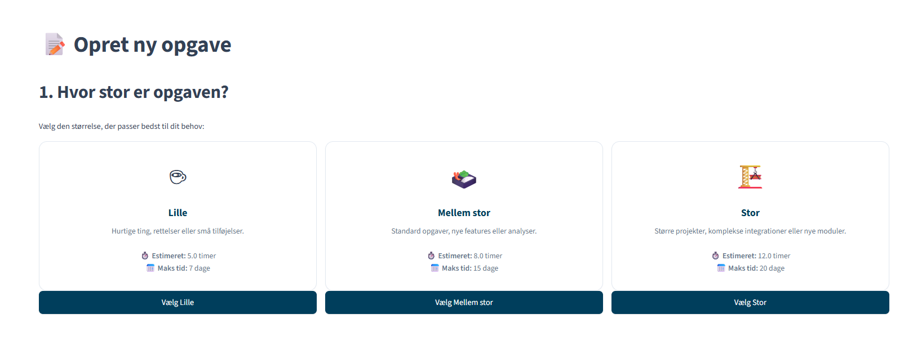
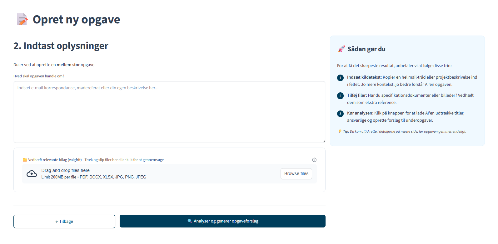
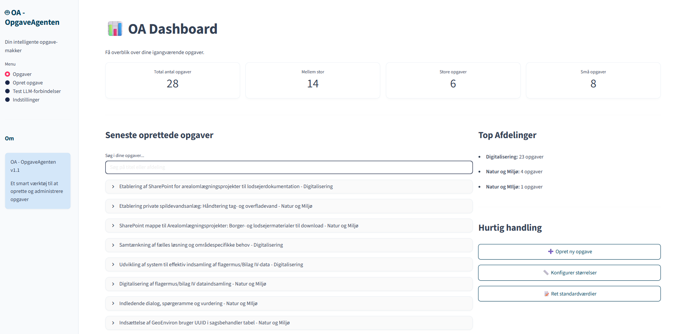
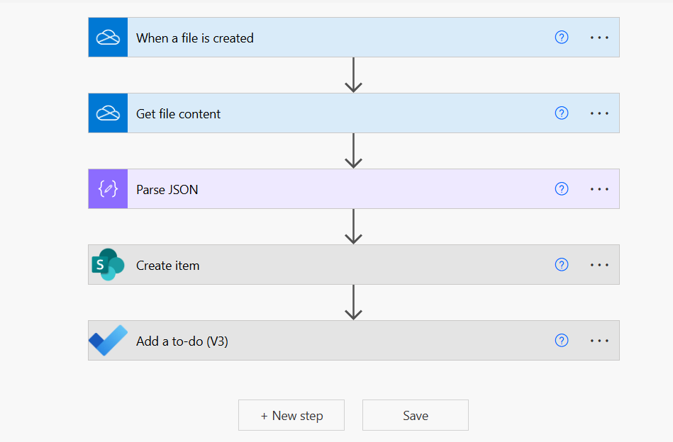

# OA - OpgaveAgenten

En intelligent webapplikation til automatisk generering og administration af opgaver ved hjælp af AI-modeller (Google Gemini og OpenAI GPT). Applikationen er bygget med Streamlit og kører lokalt i et Python virtuelt miljø.

## Funktionaliteter

### AI-drevet Opgavegenerering
- **Intelligent tekstanalyse**: Indsæt tekst (emails, beskrivelser, etc.) og få automatisk genereret strukturerede opgaver
- **Multiple LLM Providers**: Understøtter både Google Gemini (primær) og OpenAI GPT-4 som fallback
- **Dynamiske Opgavestørrelser**: Konfigurer selv rammerne for Lille, Mellem og Stor opgave via indstillingerne
- **Smart feltekstraktion**: Automatisk udtrækker titel, beskrivelse, ansvarlig person og deadlines baseret på din tekst

### Opgavestyring og Dashboard
- **OA Dashboard**: Få overblik over dine opgaver med statistik og søgefunktion direkte på forsiden
- **Programmatisk Navigation**: Hurtige handlinger på forsiden sender dig direkte til de rigtige redigerings-faner
- **Underopgaver**: Automatisk generering af relevante underopgaver baseret på hovedopgaven
- **Statussporing**: Følg opgaver gennem tilpasselige stadier (Ikke startet, I gang, Færdig, etc.)
- **Filvedhæftning**: Upload og vedhæft relevante dokumenter til opgaver

### Datalagring og -administration
- **Lokal lagring**: Opgaver gemmes lokalt i JSON-format
- **Brugerdefineret gem-mappe**: Vælg din egen mappe til at gemme opgaver (f.eks. OneDrive)
- **Søgefunktion**: Søg i tidligere opgaver via dashboardet

### Power Automate Integration
- **OneDrive integration**: Gem opgaver direkte i OneDrive for automatisk synkronisering
- **SharePoint automatisering**: Automatisk oprettelse af opgaver i SharePoint Dashboard
- **Indbygget vejledning**: Komplet trin-for-trin guide til opsætning af Power Automate flows
- **JSON format**: Alle opgaver gemmes i struktureret JSON-format klar til automatisering

### Avancerede Funktioner
- **Dynamisk Konfiguration**: Ret tovholdere, afdelinger og statuser direkte i appen uden at røre koden
- **API-test**: Indbygget test af AI-forbindelser med status-feedback

## Hurtig opstart (for alle brugere)

Hvis du bare vil i gang uden at rode med kode, så følg vores enkle guide her:  
**[KLIK HER FOR AT SE BRUGERGUIDEN (KOM_IGANG.md)](KOM_IGANG.md)**

---

## Installation (Teknisk oversigt)

### Forudsætninger
- Python 3.11+ installeret (Husk "Add to PATH")
- API-nøgler til Google Gemini og/eller OpenAI

### Nem installation
Du behøver ikke køre manuelle kommandoer. Dobbeltklik blot på:
1.  **`.env`** - Indsæt dine API-nøgler her.
2.  **`start.bat`** - Dette script ordner alt det tekniske (opretter virtuelt miljø og installerer pakker) og starter appen automatisk.

### Manuel start (hvis nødvendigt)
```bash
venv\Scripts\activate
streamlit run app.py
```

### 4. Adgang til Applikationen
Når appen kører, er den tilgængelig på: **http://localhost:8501**

## Brugervejledning

### Opret Ny Opgave
1. **Vælg opgavestørrelse**: Lille, Mellem eller Stor


*Vælg den størrelse der passer bedst til din opgave - hver størrelse har forskellige tidsestimater*

2. **Indtast tekst**: Indsæt email, beskrivelse eller anden tekst


*Indtast opgavens detaljer og vedhæft relevante filer - AI'en hjælper med at strukturere informationen*

3. **Upload filer**: Vedhæft relevante dokumenter (PDF, DOCX, XLSX, billeder)
4. **Generer opgave**: AI analyserer teksten og foreslår en struktureret opgave
5. **Rediger og tilpas**: Juster titel, beskrivelse, datoer og andre felter via dropdown-lister
6. **Gem**: Gem opgaven lokalt (gemmes som JSON i `/data`)

### Dashboard (Opgaver)
- Få overblik over statistikker centreret i toppen
- Søg i dine opgaver direkte fra forsiden
- Brug "Hurtig handling" til at springe direkte til specifikke indstillinger


*Dashboardet giver et hurtigt overblik over alle dine opgaver med statistik og søgefunktion*

### Brugerdefineret Gem-mappe
1. **Gå til Indstillinger** → **Gem-mappe**
2. **Indtast sti** til din ønskede mappe (f.eks. `C:\Users\DitNavn\OneDrive\Opgaver`)
3. **Gem indstillingen** - mappen oprettes automatisk hvis den ikke findes
4. **Alle fremtidige opgaver** gemmes nu i denne mappe

**Fordele ved OneDrive:**
- Automatisk backup til skyen
- Tilgængelig fra alle dine enheder
- Klar til Power Automate integration

### Power Automate Integration
OpgaveAgenten kan integreres med Power Automate for at automatisere workflows:


*Eksempel på Power Automate flow der automatisk opretter SharePoint opgaver fra OpgaveAgenten*

**Eksempel: Automatisk SharePoint integration**
1. Vælg en OneDrive mappe i **Indstillinger → Gem-mappe**
2. Opret et Power Automate flow med trigger "When a file is created"
3. Parse JSON-indholdet fra opgave-filen
4. Opret automatisk et element i SharePoint Dashboard

**Komplet vejledning:**
- Åbn applikationen og gå til **Indstillinger → Gem-mappe**
- Klik på "Komplet vejledning til automatisk SharePoint integration"
- Følg trin-for-trin guiden med kode-eksempler og fejlfinding

## Teknisk Arkitektur

### Teknologier
- **Frontend**: Streamlit (Python web framework)
- **AI/ML**: Google Gemini og OpenAI GPT-4
- **Datalagring**: JSON-filer

### Projektstruktur
```
OpgaveAgenten/
├── app.py                      # Hovedapplikation og UI
├── settings.json               # Dynamiske brugerindstillinger
├── config.py                   # Miljøvariabler og konfiguration
├── llm_providers.py            # AI provider logik
├── prompt_handlers.py          # AI prompt-skabeloner
├── start.bat                   # Ét-kliks Windows starter
├── requirements.txt            # Python pakker
├── .env                        # API-nøgler (skal oprettes manuelt)
└── data/                       # Her gemmes alle dine opgaver
```

## Fejlfinding

### Almindelige Problemer

**AI API-fejl**
- Test dine forbindelser via "Test LLM-forbindelser" siden
- Tjek API-nøgler i `.env` eller Indstillinger

**Applikationen starter ikke**
- Sikr at du kører `start.bat` eller har aktiveret `venv`

---

## Licens

Dette projekt er licenseret under MIT License - se [LICENSE](LICENSE) filen for detaljer.

**Version**: 1.1 (OA build)
**Sidste opdatering**: Januar 2026
**Anbefaling:** Pak ZIP-filen ud i en mappe på din computer (f.eks. `C:\Tools\OpgaveAgenten`).
**Udviklet til**: Aarhus Kommune - Digitalisering
